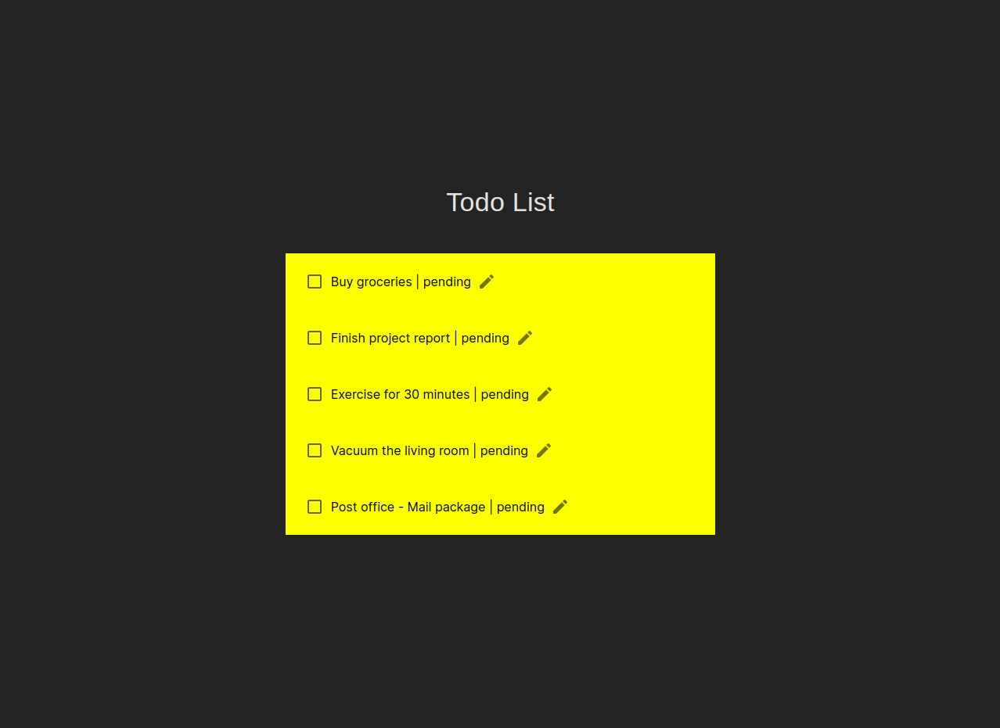

# Todo List



This template provides a minimal setup to get React working in Vite with HMR and some ESLint rules.

Todo List with React JS.

> You should use Node 18.x and latest

### Setup

1. Clone the repository:

   ```bash
   git clone https://github.com/turbolukoshko/todo-list.git
   ```

2. Navigate to the project directory:

   ```bash
   cd todo-list
   ```

3. Install dependencies:

   ```bash
   npm install
   ```

4. Run project:

```bash
npm run dev
```

> default port is http://localhost:5173
